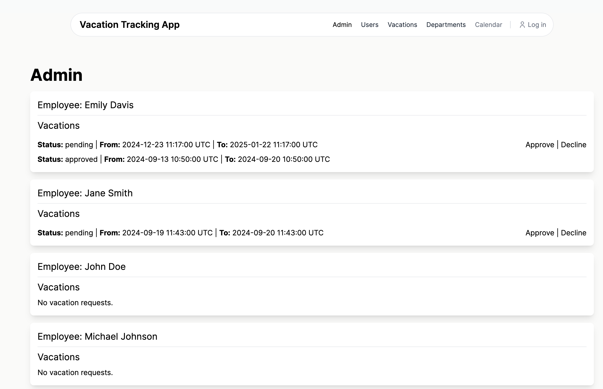
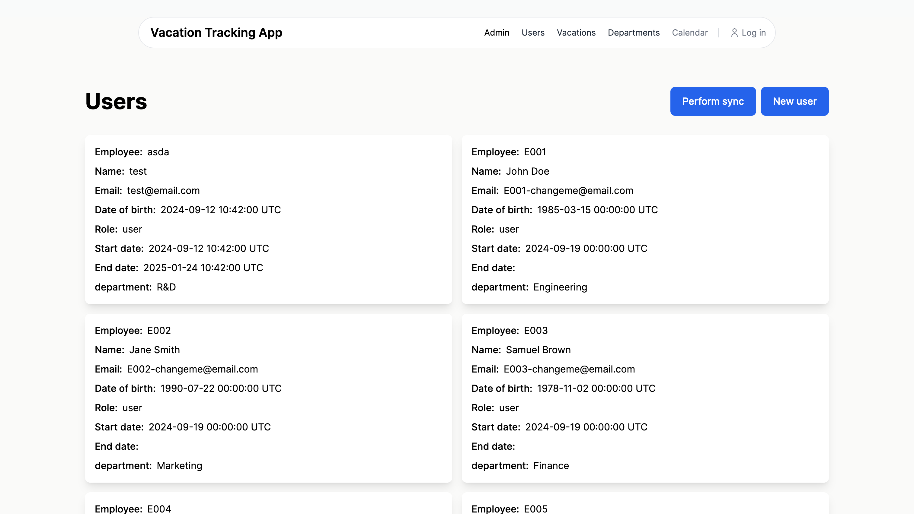
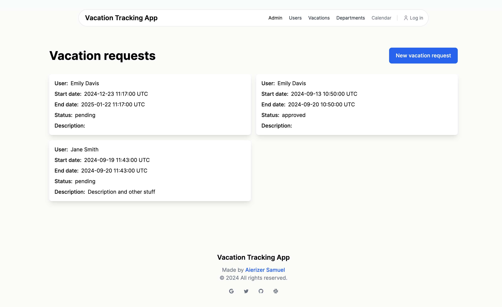

# Vacation tracking app

This is an internal vacation tracking app for employees. It also synchronizes employee data from an external API and handles vacation requests

## Install dependencies

```
sudo apt-get update  
sudo apt install git
sudo apt install openssl -y
sudo apt-get install build-essential
sudo apt-get install libz-dev  
sudo apt-get install libyaml-dev
apt-get install -y libssl-dev
sudo apt-get install -y libssl-dev
```

For Mac we would have:

```
/bin/bash -c "$(curl -fsSL https://raw.githubusercontent.com/Homebrew/install/HEAD/install.sh)"

brew doctor

brew install coreutils curl git openssl@3
```


## Install asdf and ruby

Below code may not be the latest asdf version. Check <a href="https://asdf-vm.com/guide/getting-started.html#official-download">here</a>.

```
git clone https://github.com/asdf-vm/asdf.git ~/.asdf --branch v0.14.1
echo '. "$HOME/.asdf/asdf.sh"' >> ~/.zshrc
echo '. "$HOME/.asdf/completions/asdf.bash"' >> ~/.zshrc

asdf plugin list all
asdf plugin add ruby https://github.com/asdf-vm/asdf-ruby.git
asdf install ruby latest
asdf list

ruby -version

asdf local ruby 3.3.3

ruby -v

gem install bundler
gem install rails
```

For Mac you can use: `brew install asdf`, the rest is the same. 


## Setting up the project and starting the server

Please make you have postgresql and redis-server running at this point.

```
git clone <repository>
cd <new-directory>

bundle install                # to install required gems
bundle e rails db:setup       # setup the DB
bundle e rails db:migrate     # run the migrations

./bin/dev                     # starts the server (Webserver, Sidekiq for jobs, Tailwind watcher for live CSS updates)
```


## Runing the tests

```
bundle exec rspec
```


## Deployment

We will be deploying with `kamal` but no further details provided.
 
On new deploy, don't forget `docker network create --driver bridge private`


# Screenshots

Some screenshots about project








# Future Expansion

1. Add notifications system to inform user when the background job finished
2. Add authentication and authorization (devise and pundit)
3. Add a Calendar view where you can see the vacation requests (similar to Bamboohr)
4. Add Action Text and Active Storage
